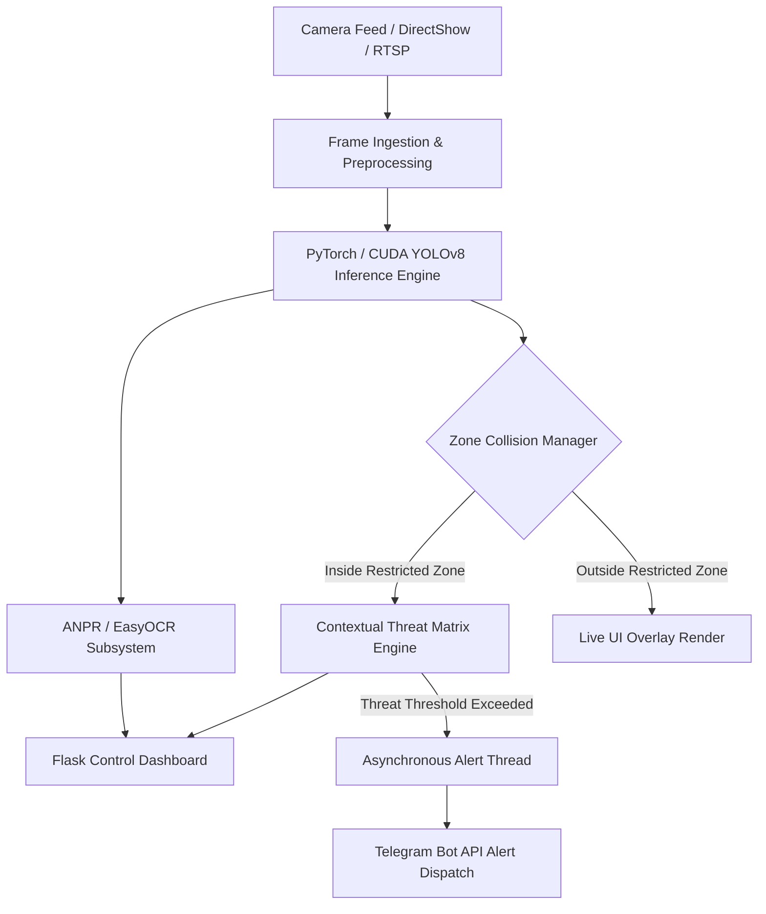

# IBVAP: Intelligent Border Video Analytics Platform

[](https://www.python.org/)
[](https://developer.mozilla.org/en-US/docs/Web/HTML)
[](https://developer.nvidia.com/cuda-toolkit)
[](https://pytorch.org/)
[](https://docs.ultralytics.com/)
[](https://flask.palletsprojects.com/)
[](https://opencv.org/)

> **IBVAP** is an edge-native video analytics prototype engineered for real-time perimeter monitoring, user-defined safe-zone tracking, dynamic contextual threat scoring, license plate region processing (ANPR), and asynchronous emergency alerts.

---

## 📌 About the Project

### System Overview
**IBVAP (Intelligent Border Video Analytics Platform)** is an edge-native surveillance and perimeter monitoring prototype designed to automate intrusion detection and contextual threat assessment in real time. Traditional CCTV systems often depend on continuous manual monitoring, which can increase operator workload during prolonged surveillance. IBVAP addresses this by combining local computer vision inference with a contextual risk-scoring engine that evaluates and prioritizes security-relevant events before generating alerts.

The platform performs primary AI-based detection locally using GPU-accelerated processing, reducing dependence on cloud-based inference and supporting low-latency video analytics. When a configured threat condition is detected, IBVAP asynchronously dispatches Telegram notifications containing event information and snapshots, enabling security personnel to receive alerts without continuously monitoring the dashboard.


---

### Key Capabilities & System Focus

* **Local Edge Analytics:** Performs local person and vehicle detection using **YOLOv8** with CUDA-accelerated processing.
* **Dynamic Safe Zones:** Enables operators to create and modify polygon-based restricted zones directly on live video through the web interface.
* **Contextual Threat Matrix:** Evaluates security events using a **0–100 risk scale** based on target class, dwell time, movement, and zone severity.
* **Automated ANPR:** Processes vehicle regions using **OpenCV + EasyOCR** to extract and log license plate information.
* **Asynchronous Alerts:** Uses a background worker to send **Telegram notifications with event snapshots** without blocking the video-processing pipeline.
* **Unified Dashboard:** Provides a **Flask-based web interface** for live video monitoring, zone configuration, analytics, and event information.

---

## 📸 System Overview


*Figure 1: IBVAP Monitoring Command Dashboard displaying live camera stream, zone boundary overlays, and real-time threat telemetry.*

---

## 🏗 Platform Architecture


## 🖼 Real-World Hardware & Field Testing

| Local Edge Hardware Testbed | Real-Time Threat & Zone Tracking |
| :---: | :---: |
|  |  |
| *Figure 2: Edge hardware configuration running local analytics with a USB camera source.* | *Figure 3: Active target detection with bounding box classification and custom polygon zone overlays.* |

---

## 🚀 Quickstart & Setup Guide

### 1. Prerequisites
* **Python 3.10+** installed on the host system.
* **NVIDIA Drivers & CUDA Toolkit** (Required for GPU inference; defaults to CPU execution if CUDA is unavailable).

  # Clone repository
git clone [https://github.com/your-username/IBVAP.git](https://github.com/ansonjolly33/IBVAP.git)
cd IBVAP

# Create and activate virtual environment
python -m venv venv
source venv/bin/activate  # On Windows use: venv\Scripts\activate

# Install dependencies
pip install --upgrade pip
pip install -r requirements.txt

## 🚀 Running the Application

Start the IBVAP platform execution loop:

```bash
python app.py

```
## 📁 Repository Structure

```text
IBVAP/
├── IBVAP images/                 # Documentation screenshots and UI assets
├── __pycache__/                  # Python compiled bytecode cache
├── security_logs/                # Generated system event logs
├── static/
│   └── breaches/                 # Captured breach snapshot images
├── telegram_alerts/              # Dispatched alert records
├── templates/                    # Web UI HTML templates
├── .env.example                  # Environment configuration template
├── .gitignore                    # Git tracking exclusion configuration
├── README.md                     # Primary repository documentation
├── anpr_engine.py                # License plate processing submodule
├── app.py                        # Main Flask server & application entry point
├── frs_anpr_module.py            # Facial recognition & ANPR integration module
├── haarcascade_frontalface_default.xml # Haar Cascade face detection classifier
├── main.py                       # Standalone engine execution script
├── mudule1_virtual_fence.py      # Core virtual fence & zone management logic
├── module4_event_logger.py       # Event logging utility module
├── module5_alarm_fence.py        # Alarm trigger and breach handler
├── module6_loitering_capture.py  # Dwell time and loitering analysis module
├── module7_telegram_alerts.py    # Asynchronous Telegram alert integration
├── test_alert.ipy                # Alert system Jupyter testing notebook
├── test_telegram.py              # Telegram API verification script
├── virtual_fence.py              # Polygon spatial math utilities
└── yolov8n.pt                    # Pre-trained YOLOv8 nano weights model
```
## 📜 Compliance & Guidelines Alignment

* **MHA PIDS Guidelines:** Aligned with Ministry of Home Affairs Qualitative Requirements for Perimeter Intrusion Detection Systems.
* **ONVIF Framework:** Aligned with industry standards for IP security camera streaming protocols (RTSP/RTP) and camera interoperability.

---

## 📄 License

This project is licensed under the [MIT License](LICENSE).


