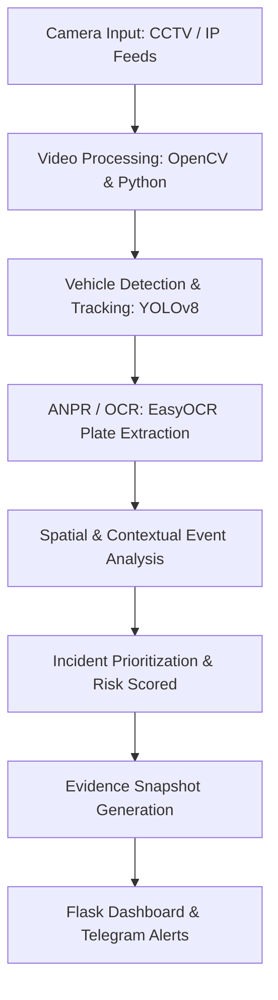
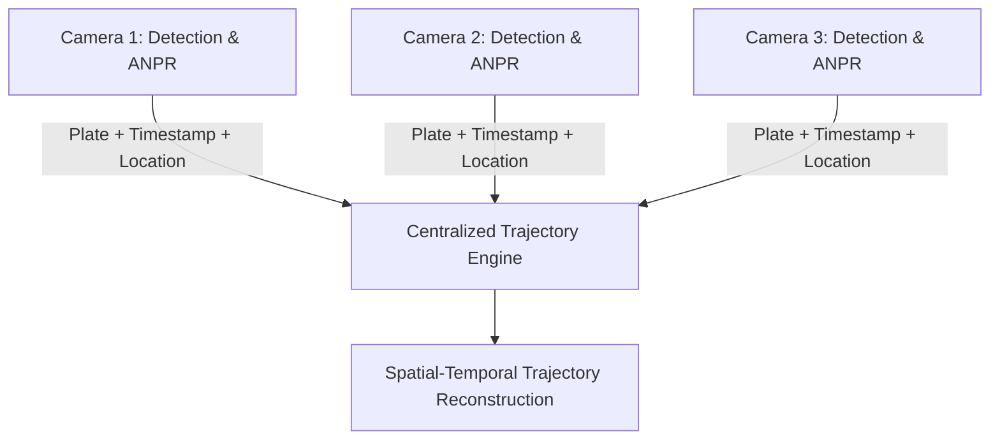

# UTAE: Urban Traffic Analytics Engine

[](https://www.python.org/)
[](https://developer.mozilla.org/en-US/docs/Web/HTML)
[](https://opencv.org/)
[](https://developer.nvidia.com/cuda-toolkit)
[](https://pytorch.org/)
[](https://docs.ultralytics.com/)
[](https://flask.palletsprojects.com/)
[](https://github.com/JaidedAI/EasyOCR)

> **UTAE** is a GPU-accelerated urban traffic intelligence prototype focused on ANPR, vehicle detection and tracking, spatial-temporal traffic analysis, and automated incident alerting, with multi-camera trajectory reconstruction and GIS-based analytics defined as target capabilities.

---

## 📌 About the Project

### System Overview

**UTAE (Urban Traffic Analytics Engine)** is a centralized AI software platform developed to demonstrate how existing CCTV and ANPR camera feeds can be processed through a unified urban traffic monitoring workflow.

The current working prototype combines computer vision, vehicle detection and tracking, number-plate extraction, virtual-zone monitoring, risk-based incident analysis, dashboard visualization, incident snapshots, and automated Telegram alerts.

The architecture is designed to extend these capabilities toward multi-camera vehicle correlation, trajectory reconstruction, GIS-based movement visualization, and broader urban traffic analytics in accordance with the requirements of **Smart India Hackathon Problem Statement 26127**.

---

### Key Capabilities & System Focus

* **Vehicle Detection & Tracking:** Uses **YOLOv8** for AI-based vehicle detection and tracking from video streams.
* **ANPR / OCR:** Uses **EasyOCR** to extract number-plate text from detected vehicle regions.
* **Spatial Monitoring:** Supports operator-defined polygon zones for monitoring activity within selected areas.
* **Contextual Incident Analysis:** Processes configured event conditions and displays associated risk information.
* **Automated Alerts:** Uses asynchronous alert processing to send configured incident notifications through Telegram.
* **Evidence Generation:** Captures incident snapshots and maintains event-related information for later verification.
* **Centralized Dashboard:** Provides a **Flask-based web interface** for live monitoring, vehicle information, zone monitoring, and incident visualization.
* **GPU Acceleration:** Supports CUDA-accelerated processing for AI workloads where compatible NVIDIA hardware is available.

---
## 🖼️ Prototype & Live Implementation

This section showcases the functional prototype and user interface components of the Urban Traffic Analytics Engine.

### 1. Command & Control Dashboard

*Centralized interface displaying processed live camera feeds, detected vehicle telemetry, spatial monitoring zones, and immediate status logging.*


---

### 2. Hardware & Multi-Monitor System Setup

*Physical multi-camera monitoring console and developer workspace executing CUDA-accelerated model inferences in real time.*

---

### 3. Hardware Execution & Dual-Display Prototype

*Dual-display execution environment running concurrent AI video streams alongside real-time tracking logs.*

---

### 4. Automated Threat & Incident Alerts

*Real-time threat detection interface triggering immediate visual alerts and telemetry extraction for flagged vehicle incidents.*

---

### 5. Evidence & Snapshot Generation

*Automated audit and evidence collection module capturing incident snapshots, optical character recognition logs, and timestamped metadata.*


---

## 🔄 System Workflow


### 🏗️ Platform Architecture
The current prototype architecture consists of:

1. Data Source
Supported video sources provide:

CCTV / IP camera streams

Video input

Vehicle activity

2. Video Processing
Live video stream

Frame extraction

Image processing

Camera-wise processing

3. AI Detection & Tracking
The prototype uses:

YOLOv8 vehicle detection

Vehicle tracking

Vehicle classification where supported by the detection model

OpenCV-based video processing

GPU-accelerated inference where CUDA is available

4. ANPR / OCR
The number-plate processing pipeline uses:

Vehicle region extraction

Number-plate region processing

EasyOCR

Extracted plate text

5. Spatial & Event Analysis
The prototype supports:

Polygon-based monitoring zones

Zone activity analysis

Configured event conditions

Risk information

6. Alert & Evidence Generation
The system can generate:

Incident snapshots

Event information

Risk information

Telegram notifications

7. Command Dashboard
The Flask dashboard provides:

Live video monitoring

Vehicle information

Zone monitoring

Incident information

Risk information

Event visualization

### 🖥️ Prototype
The following sections represent the working prototype and its demonstrated functionality.

Command & Control Dashboard
The dashboard provides a centralized interface for viewing the processed video stream, detected vehicles, monitoring zones, event information, and associated telemetry.

Centralized Analytics UI
Unified view showing real-time traffic statistics, spatial zones, and live detection feeds.

Hardware & System Execution Prototype
Multi-monitor setup showing real-time processing execution and live feed analytics.

Real-Time Threat Alerts
Configured incidents generate instant threat alerts with risk telemetry and evidence snapshots.

Evidence & Event Output
The prototype generates supporting event records including captured snapshots, vehicle details, plate information, and risk alerts.

Note: Screenshots in this repository represent the project's working prototype/demo.

## 🧠 Vehicle Detection & Intelligence

The prototype combines multiple computer-vision components to convert video streams into structured vehicle and incident information.

| Capability | Purpose |
| :--- | :--- |
| **Vehicle Detection** | Identifies vehicles in the video stream |
| **Vehicle Tracking** | Tracks detected vehicles within the camera view |
| **Vehicle Classification** | Provides supported vehicle-class information |
| **ANPR / OCR** | Extracts available number-plate text |
| **Zone Monitoring** | Monitors activity within operator-defined regions |
| **Event Analysis** | Evaluates configured incident conditions |
| **Risk Information** | Provides contextual information for detected events |
| **Alert Generation** | Sends notifications for configured incidents |
| **Evidence Capture** | Preserves incident snapshots |

## 🔎 Automatic Number Plate Recognition

UTAE uses an OCR-based ANPR pipeline to extract available number-plate information from detected vehicle regions.

The processing flow is:
$$\text{Vehicle Detection} \longrightarrow \text{Vehicle Region} \longrightarrow \text{Number-Plate Processing} \longrightarrow \text{EasyOCR} \longrightarrow \text{Plate Text}$$

The extracted information can be associated with:
* Vehicle detection
* Camera source
* Timestamp
* Event information
* Detection history

## 🚗 Vehicle Tracking

YOLOv8-based processing provides vehicle detection and tracking within the video stream.

The tracking pipeline operates as follows:
$$\text{Camera / Video Input} \longrightarrow \text{Frame Processing} \longrightarrow \text{YOLOv8 Detection} \longrightarrow \text{Vehicle Identification} \longrightarrow \text{Tracking} \longrightarrow \text{Vehicle Movement Info}$$

## 🗺️ Multi-Camera Trajectory Architecture

The SIH problem statement requires spatial-temporal tracking of a single vehicle across geographically distributed cameras. UTAE identifies this as a target architecture capability built on top of the current vehicle detection, tracking, ANPR, and event-processing pipeline.


### 🌐 GIS & Mapping Architecture

```markdown
## 🌐 GIS & Mapping Architecture

GIS-based visualization is identified as a target capability for the complete SIH solution.

The intended architecture utilizes:
* Leaflet.js / OpenStreetMap
* Camera latitude/longitude
* Detection timestamps & historical vehicle trajectory records
```
## 📊 Urban Traffic Analytics

UTAE's architecture is designed to support city-level traffic analysis using aggregated vehicle observations:

* **Traffic Density:** Analysis of vehicle activity across monitored camera locations.
* **Vehicle Movement:** Analysis of vehicle movement through individual camera regions.
* **Route Patterns:** Correlation of vehicle observations across multiple locations to identify movement sequences.
* **Congestion Analysis:** Use of vehicle counts and dwell-time information to identify areas with increased traffic activity.

## 📍 Virtual Zone Monitoring

The current prototype supports operator-defined polygon zones.

$$\text{Camera Feed} \longrightarrow \text{Operator Polygon} \longrightarrow \text{Zone Monitoring} \longrightarrow \text{Event Detection} \longrightarrow \text{Condition Evaluation} \longrightarrow \text{Incident Info}$$

## 📍 Virtual Zone Monitoring

The current prototype supports operator-defined polygon zones.

$$\text{Camera Feed} \longrightarrow \text{Operator Polygon} \longrightarrow \text{Zone Monitoring} \longrightarrow \text{Event Detection} \longrightarrow \text{Condition Evaluation} \longrightarrow \text{Incident Info}$$

## 📡 Automated Alert System

UTAE uses asynchronous alert processing for configured incident notifications via Telegram.

$$\text{Event Detection} \longrightarrow \text{Condition Evaluation} \longrightarrow \text{Incident Identified} \longrightarrow \text{Evidence Snapshot} \longrightarrow \text{Telegram Notification}$$

## 🧰 Technology Stack

| Technology | Role |
| :--- | :--- |
| **Python** | Core application and processing logic |
| **PyTorch** | Deep-learning framework |
| **YOLOv8** | Vehicle detection and tracking |
| **OpenCV** | Video processing and computer vision |
| **CUDA** | GPU acceleration framework |
| **EasyOCR** | Number-plate OCR extraction |
| **Flask** | Web application backend framework |
| **HTML / CSS / JS** | Dashboard command interface |
| **Telegram Bot API** | Automated alert delivery |
| **CSV / Event Logging** | System event records |

## 🎯 SIH Problem Statement Alignment

| SIH Requirement | UTAE Alignment |
| :--- | :--- |
| **High-Accuracy ANPR / OCR** | EasyOCR-based ANPR pipeline; higher accuracy is an evaluation target |
| **Multi-Camera Tracking** | Target architecture for correlating vehicle observations across cameras |
| **Single Plate Trajectory Tracking** | Target capability using plate, timestamp, and camera information |
| **GIS-Based Movement** | Target Leaflet.js / OpenStreetMap integration |
| **Traffic Density & Heatmaps** | Target activity analysis and geographical visualization architecture |
| **Blacklisted Vehicle Alerts** | Target watchlist database integration |
| **Centralized Dashboard** | Implemented Flask-based web command dashboard |
| **Existing CCTV Infrastructure** | Software-based processing of available video streams |

## ⚙️ System Modules

* **Module 1 — Vehicle Detection:** Detects vehicles using YOLOv8.
* **Module 2 — Vehicle Tracking:** Tracks objects within camera view.
* **Module 3 — ANPR / OCR:** Extracts number-plate text using EasyOCR.
* **Module 4 — Zone Monitoring:** Operator-defined polygon monitoring.
* **Module 5 — Event Analysis:** Evaluates threshold & condition triggers.
* **Module 6 — Risk Information:** Attaches risk context to incidents.
* **Module 7 — Dashboard:** Central Flask interface.
* **Module 8 — Alert System:** Telegram API integration.
* **Module 9 — Evidence Generation:** Snapshot capture and audit logs.
* **Module 10 — Multi-Camera Intelligence:** Architectural target framework for trajectory correlation.

## 📁 Repository Structure

```text
UTAE/
├── UTAE images/                  # Screenshots and UI visual assets
│   ├── dashboard.png
│   ├── prototype.png
│   ├── snapshots.png
│   ├── System Setup.png
│   ├── Threat Alert.png
│   └── UTAE dashboard.png
├── __pycache__/                  # Python compiled bytecode cache
├── security_logs/                # Generated system event logs
├── static/
│   └── breaches/                 # Captured incident snapshots
├── telegram_alerts/              # Generated Telegram alert records
├── templates/                    # Web UI HTML templates
├── .env.example                  # Environment configuration template
├── .gitignore                    # Git tracking exclusions
├── README.md                     # Project documentation
├── anpr_engine.py                # License plate processing and OCR
├── app.py                        # Main Flask application
├── frs_anpr_module.py            # Vehicle / ANPR integration module
├── haarcascade_frontalface_default.xml # Haar Cascade classifier
├── main.py                       # Standalone engine execution
├── mudule1_virtual_fence.py      # Spatial tracking and zone logic
├── module4_event_logger.py       # Event logging utility
├── module5_alarm_fence.py        # Event / threshold handling
├── module6_loitering_capture.py  # Dwell-time analysis
├── module7_telegram_alerts.py    # Telegram alert integration
├── test_alert.ipy                # Alert-system testing notebook
├── test_telegram.py              # Telegram API testing
├── virtual_fence.py              # Polygon zone utilities
└── yolov8n.pt                    # YOLOv8 model weights
```

### 🚀 Quickstart & Setup Guide

```markdown
## 🚀 Quickstart & Setup Guide

### 1. Prerequisites
* **Python 3.10+**
* **NVIDIA Drivers & CUDA Support** (Recommended for GPU acceleration)

### 2. Installation Steps

```bash
# Clone Repository
git clone [https://github.com/ansonjolly33/IBVAP.git](https://github.com/ansonjolly33/IBVAP.git)
cd IBVAP

# Create Virtual Environment
python -m venv venv

# Activate Virtual Environment (Windows)
venv\Scripts\activate

# Activate Virtual Environment (Linux / macOS)
source venv/bin/activate

# Install Dependencies
pip install --upgrade pip
pip install -r requirements.txt

***

### 🚀 Running the Application

```markdown
## 🚀 Running the Application

Start the Flask application:

```bash
python app.py
```


## 👥 Team

* **Team:** Mustangs
* **Project:** UTAE – Urban Traffic Analytics Engine
* **Hackathon:** Smart India Hackathon 2026
* **Problem Statement ID:** 26127
* **Organization:** Bharat Electronics Limited
  
## 📄 License This project is licensed under the [MIT License](LICENSE).

  ## 🏁 Conclusion

$$\text{Detection} \longrightarrow \text{Recognition} \longrightarrow \text{Correlation} \longrightarrow \text{Tracking} \longrightarrow \text{Analytics} \longrightarrow \text{Action}$$

